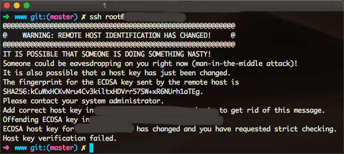

# Linux

## 如何连接远程服务器

```
ssh root@ip address
$passworld
```
## Linux 简单命令

`reboot`: 重启

### 压缩解压缩命令
tar

- 解包：`tar zxvf filename.tar`
- 打包：`tar czvf filename.tar dirname`

gz命令

- 解压1：`gunzip filename.gz`
- 解压2：`gzip -d filename.gz`
- 压缩：`gzip filename`

.tar.gz 和  .tgz

- 解压：`tar zxvf filename.tar.gz`
- 压缩：`tar zcvf filename.tar.gz dirname`
- 压缩多个文件：`tar zcvf filename.tar.gz dirname1 dirname2 dirname3.....`

bz2命令

- 解压1：`bzip2 -d filename.bz2`
- 解压2：`bunzip2 filename.bz2`
- 压缩：`bzip2 -z filename`

.tar.bz2

- 解压：`tar jxvf filename.tar.bz2`
- 压缩：`tar jcvf filename.tar.bz2 dirname`

bz命令

- 解压1：`bzip2 -d filename.bz`
- 解压2：`bunzip2 filename.bz`

.tar.bz
- 解压：`tar jxvf filename.tar.bz`

z命令
- 解压：`uncompress filename.z`
- 压缩：`compress filename`

.tar.z

- 解压：`tar zxvf filename.tar.z`
- 压缩：`tar zcvf filename.tar.z dirname`

zip命令

- 解压：`unzip filename.zip`
- 压缩：`zip filename.zip dirname`

## known_hosts 文件

每次在远程连接服务器时，本机会校验当前服务器返回的 host key 。 当重新安装系统时，再次远程连接，这个 host key 会发生改变，所以会出现如下错误



解决办法：

更改 known_hosts 文件，将原有服务器的 host key 删除掉，然后退出保存，再次连接远程服务器即可

位置在 ~/.ssh/konwn_hosts中

```
vim konwn_hosts
```