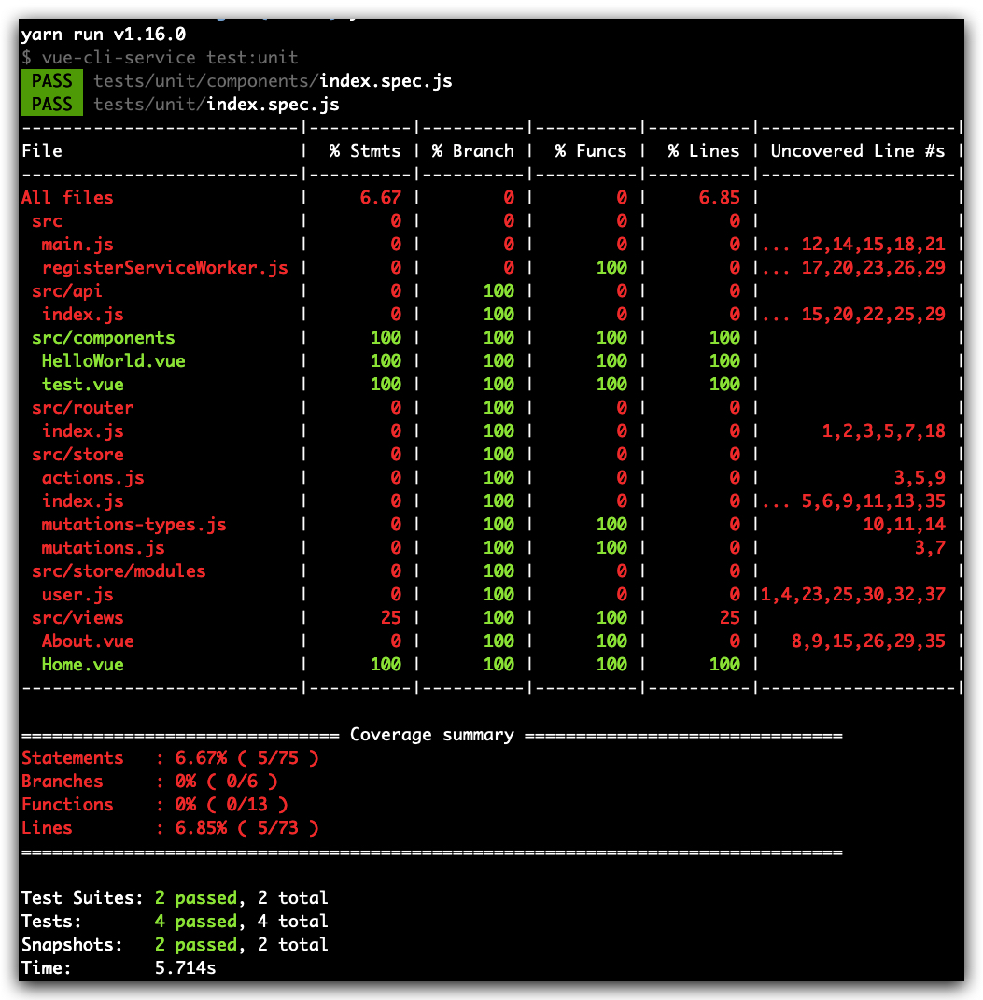

# Vue 单元测试

## 起步

详细的单元测试文档可以参考 [Vue Test Utils](https://vue-test-utils.vuejs.org/zh/)

::: tip
对于 UI 组件来说，我们不推荐一味追求行级覆盖率，因为它会导致我们过分关注组件的内部实现细节，从而导致琐碎的测试。

取而代之的是，我们推荐把测试撰写为断言你的组件的公共接口，并在一个黑盒内部处理它。一个简单的测试用例将会断言一些输入 (用户的交互或 prop 的改变) 提供给某组件之后是否导致预期结果 (渲染结果或触发自定义事件)。
:::

## 项目结构

```
.
└─ tests
   └─ coverage
   └─ unit
      └─ __snapshots__
         └─ index.spec.js.snap
         └─ index.spec.js
```

## 如何编写测试代码

#### 待测试的组件
``` js
export default {
  template: `
    <div>
      <span class="count">{{ count }}</span>
      <button @click="increment">Increment</button>
    </div>
  `,

  data() {
    return {
      count: 0
    }
  },

  methods: {
    increment() {
      this.count++
    }
  }
}
```

#### 测试代码

``` js
import { mount } from '@vue/test-utils'
import Counter from './counter'

describe('测试该组件', () => {
  // 现在挂载组件，你便得到了这个包裹器
  const wrapper = mount(Counter)

  it('渲染正确的标记', () => {
    expect(wrapper.html()).toContain('<span class="count">0</span>')
  })

  // 也便于检查已存在的元素
  it('有一个按钮', () => {
    expect(wrapper.contains('button')).toBe(true)
  })
})
```

#### 模拟用户交互行为

``` js
it('单击按钮 count 值为1', () => {
  expect(wrapper.vm.count).toBe(0)
  const button = wrapper.find('button')
  button.trigger('click')
  expect(wrapper.vm.count).toBe(1)
})
```

::: tip
单元测试并不关注你的过程，只关注你的结果
:::

## 高阶用法

例如对 `Vuex` 和 `Vue-router` 进行测试可以参照文档进行使用 [配合 Vue Router 使用](https://vue-test-utils.vuejs.org/zh/guides/#%E9%85%8D%E5%90%88-vue-router-%E4%BD%BF%E7%94%A8) 和 [在组件中测试 Vuex](https://vue-test-utils.vuejs.org/zh/guides/#%E5%9C%A8%E7%BB%84%E4%BB%B6%E4%B8%AD%E6%B5%8B%E8%AF%95-vuex)


## 如何使用

一条命令即可运行单元测试

``` base
yarn test:unit
```

运行后结果如图



### 查看测试 log

查看测试生成的本地文件目录，查看测试覆盖率，行，方法等

``` base
yarn test:coverage
```


