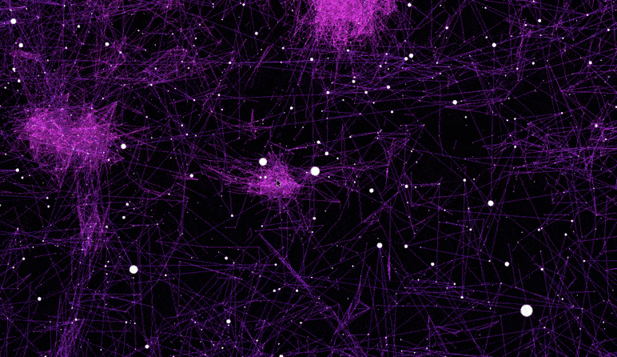

# 构建一个词汇星空

最近在搞一个词汇分类，而且要炫酷的那种，用的叫 t-SNE 的一个东西，百度谷歌了一下，才理解是一种降维算法，索性就搜搜看看有没有好的开源库，果然找到了一个前后端配合使用的一套开源库，并且也十分的够炫酷。

现在记录一下如何跑起来这个东西

先看看长什么样。。。

该可视化从高维word2vec嵌入构建了最近邻居图(Nearest neighbor graph)。

### 环境要求

1. node
2. git
3. python

### 第一步 `clone` 项目

首先 `clone` 下来 [https://github.com/anvaka/word2vec-graph](https://github.com/anvaka/word2vec-graph) 这个项目是 `python` 写的后端生成数据集的一个工具

然后在 `clone` 下来前端展示的项目 [https://github.com/anvaka/pm](https://github.com/anvaka/pm) 这个项目采用 `React` 和 `WebGL` 技术来进行数据的前端三维展示

接下来就是对应的安装各自的依赖包等，不在此过多赘述

### 第二步 配置后端所需词向量

需要一个词向量数据源，用后端来生成前端所需要的 `labels.json`  `links.bin`  `position.bin` 等等

词向量数据选可以在 [这里](https://nlp.stanford.edu/projects/glove/) 进行下载

1. 然后将下载后的词向量放在 `graph-data/xxx.txt` 这里，
2. 在 `save_text_edges.py` 文件中，修改词向量源。
3. 运行 `python save_text_edges.py` - 取决于输入词向量文件的大小，这需要一段时间。输出文件 `edges.txt` 将被保存在 `graph-data` 文件夹中
4. 运行 `node edges2graph.js graph-data/edges.txt` - 这将以二进制格式将图形保存到 `graph-data` 文件夹（graph-data / labels.json，graph-data / links.bin
5. 然后运行 `node --max-old-space-size=12000 layout.js` 来生成布局，最大允许 RAM 为12G
6. 可以交给前端系统来进行数据的渲染了

### 第三步 配置前端

需要将后端生成的 `labels.json`  `links.bin`  `position.bin` 三个文件来上传到你的服务器上

更改项目中的 `src/config.js` 中的服务地址改为你服务器的地址就可以了，按照 [https://github.com/anvaka/galactic-data](https://github.com/anvaka/galactic-data) 他的数据格式来进行修改，当然你也可以更改源码，配置你所希望的请求路径

配置好后，就可以通过 `npm start` 来启动项目，如果请求路径等信息确认无误，那么浏览器中展示的就应该是你的数据集了。

- **参考文献**
    > [https://zhuanlan.zhihu.com/p/35475412](https://zhuanlan.zhihu.com/p/35475412)